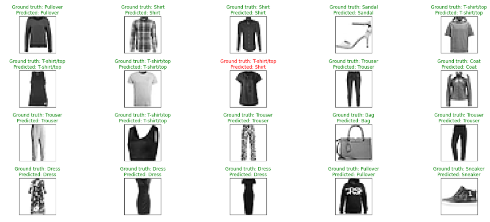

# Skirts or Pants?

## Project Overview
I created an image classification application using a deep neural network with convolutions. This application trains a deep learning model on a dataset of fashion item images. It then uses the trained model to classify new images.

## Key Skills Demonstrated:
* Tensorflow
* Convolutional neural networks
* Model validation and evaluation

## Objective
To create a model that correctly classifies images of fashion items

## Repository Navigation
The project is documented in [Fashion_MNIST_Image_Classifier_CNN.ipynb](https://github.com/toluwee/Classifying-Fashion-MNIST-Dataset-with-CNN-Deep-Learning/blob/master/Fashion_MNIST_Image_Classifier_CNN.ipynb). 

## Outcome

